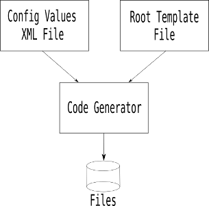

### Introduction

I built this code generator because I couldn't find anything that would generate whatever code I wanted the way that I wanted. Even now, more than ten years later, most of the generators you will find are only able to output very specific files for very specific uses. This generator, on the other hand, should be thought more as text generator than just a code generator.

It might be best to start with the work flow of the generator.

It takes two inputs: a "root" template file and a matching config values file that contains the values to be substituted into the template(s). The root template file will contain one or more output tags, probably in one or more `foreach` blocks.

At the moment, there is only one output type tag: `file`. While I have not yet needed any other outputs, it is possible to write new ones that output to other targets. I guess one easy example (but I'll deny it if you tell anyone I said this) would be generating email to a network address. As with every other possible use for this generator, the only limitation is your imagination.

In fact, that's why I'm putting this out into the ether. I'm really hoping people will come up with interesting things to do with this. Of course, given the massive haystack that Github has grown into, I'll be amazed if anyone even finds this. If you've gotten this far, thank you!

I have a few ideas to get you started, but we need to talk a little more about how the generator works.

### Config Value Files

The config values file holds the values that are substituted into the template when the template is evaluated. It is an XML file with a very simple tree structure that lets you create as complex a definition of your functional domain as you need. Here is an example taken from the {@link codegenerator.generator.tags.ConfigVariable} documentation:

    <?xml version="1.0" encoding="UTF-8"?>
    <Node name="root">
        <Node name="global">
            <Value name="databaseName">Operations</Value>
            <Value name="packageName">codegenerator.examples.operations</Value>
            <Value name="outputPath">/home/dev/temp/code_generator/operations_db</Value>
        </Node>
        <Node name="table">
            <Value name="className">User</Value>
            <Value name="sqlName">USER</Value>
            <Node name="column">
                <Value name="name">UserId</Value>
                <Value name="sqlName">USER_ID</Value>
                <Value name="memberName">userId</Value>
                <Value name="type">int</Value>
                <Value name="isNullable">false</Value>
                <Value name="isPrimaryKey">true</Value>
            </Node>
            <Node name="column">
                <Value name="name">LoginName</Value>
                <Value name="sqlName">LOGIN_NAME</Value>
                <Value name="memberName">loginName</Value>
                <Value name="type">varchar</Value>
                <Value name="valueMaxSize">50</Value>
                <Value name="isNullable">false</Value>
                <Value name="isPrimaryKey">false</Value>
            </Node>

            ...

        </Node>

        ...

    </Node>

This XML format comes from the ConfigManager in CoreUtils. The `<Node>`s can hold `<Node>`s and `<Value>`s. The `<Value>`s only contain a string value. Both tags have a required "name" attribute and an optional "description" attribute. You can make your config file as simple or complex as your templates require with this structure.

If you can agree on a config values file structure with other people, then you can each create template sets that can generate solutions in different languages and/or tool sets. For example, if you used the database-oriented example above, then you could combine templates from multiple sources to generate database access code for every language used in your project. Any database definition changes that you make in the config file or changes to the templates can be almost instantly updated across the whole code base. Even if that is thousands of files.

And since this generator isn't limited to code, you can generate any other text files that you need, too. For example, the example templates have a template that will generate a DDL file at the same time as the database access code.

And you aren't limited to database code. You could set up config value files and templates to generate web pages, GUI apps or project files. Or whatever.

### Template Files

Template files are the hairier part of this equation. As you can see from the examples, they can be pretty hard to decipher on the first look (or fifth for that matter). But they don't have to start that way.

All of my templates started off as hand-coded files that I wound up copying and altering at least two or three times to make other instances (database access classes being a perfect example). By that point, I had tweaked and fixed enough that I had a reliable pattern that I could be confident that I wanted to templatize. Then I could make a new copy and start adding template tags, at each step running a generation to compare to the originals. That lets you build up the complexity instead of trying to create the template from scratch.

While the example templates are going to be your best resource for seeing how to use the various tags, I've tried to give some useful documentaion for them in the `CodeGenerator/doc` javadocs. But there may be things I've missed or should reemphasize so I'll cover some of the ones that come to mind here.

Probably the most important one is the one *required* element for a template: the header record. Here's the one in all of the examples:

    %%HEADER%% openingDelimiter=<% closingDelimiter=%>

Every tag needs an opening and closing delimiter so that the parser can separate them from other text in the template. But since one my major goals for this generator was that it not be language specific, I had to have a way to specify delimiters that might need to be different for each language that a template might be written for. (The other major goal was that it had to generate pretty code.) And it couldn't be limited to just one character each, or even two, because different characters or character sequences might be part of the target language so you have to be able to choose delimiters that won't ever be in valid code. And the opening and closing delimiters don't even have to be like each other in any way if you don't want, or if there are conflicts with the language. The header record lets you tell the parser what delimiters to look for in the rest of the template.

#### Tag Usage

The flow control tags can be used anywhere, including nested inside other flow control tags (or themselves, for that matter). For a more in-depth look at each of the tags, please refer to the javadocs. Here are examples of the flow control tags:

    <%foreach node=column%>
    ...
    <%endfor%>

 Note: any number of `elseif` tags can be used inside an `if` tag.

    <%if  <%type%> = Integer %>
    ...
    <%elseif  <%type%> = Long %>
    ...
    <%else%>
    ...
    <%endif%>

 `first` blocks can technically be nested inside themselves, but it wouldn't make any sense to do so.

    <%first%>
    ...
    <%else%>
    ...
    <%endfirst%>

The `text` tag is special. You can have text inside or outside of flow control blocks, but you *can not* have flow control blocks inside a `text` tag. A `text` tag can have anything from a single character in it up to any number of lines. There are also certain special tags that can appear inside a `text` tag. Here's the `text` tag:

    <%text%>
    ...
    <%endtext%>

Here are the tags that be inside a `text` block. Note that the one common aspect of all of these tags is that none of them have closing tags like the flow control tags.

The config variable is a unique tag type because it looks like all the other tags because it uses the opening and closing delimiters, but the name inside the delimiters is the name of a value from the config values file. That also means that the other tag names are reserved and cannot be used as config value names. Here's an example:

    <%className%>

These are the other tags that can appear inside a `text` block:

    <%customCode key=LoadAll<%className%>CacheCode commentCharacters=// %>

    <%firstLetterToLowerCase member = <%className%> %>

    <%tabMarker%>

    <%tabStop stopType = "stop" offset = "40" %>

    <%typeConvert targetLanguage = "java" sourceType = <%type%> groupID = "builtin" %>

Note that, as you can see in the examples, since the config variable and `typeConvert` tags (and technically the `firstLetterToLowerCase` tag) evaluate to strings, they can be used in the values of other tag's attributes (usually the `if`/`elseif` tags).

There are two tags left. The first is the `tabSettings` tag. If a template uses either `tabMarker` or `tabStop`, then you have to have a `tabSettings` that appears first to define the tab length and whether the tabs will be output as spaces or tabs. Here is an example:

    <%tabSettings tabLength = "4" outputType = "tabs" %>

And the last tag is the decrement counter tag. It looks like this:

    <%--counter%>

This is a special tag to use in conjunction with a `first` block inside a `foreach` block. There will be times when you need to build a delimited list of values (such as a parameter list), but one or more of the first items in the list may need to be skipped. When that happens, you need to use the `--counter` tag to bump the loop counter back one each time you skip so that when you do get to the first item you want to add to the list, then the `first` block will work correctly.

#### Custom Code Blocks

Custom code blocks let you designate spots in the output where users can enter custom code that will be protected the next time the generator is run on top of those files. Here again is the tag example from above:

    <%customCode key=LoadAll<%className%>CacheCode commentCharacters=// %>

The `commentCharacters` attribute lets you specify the single-line comment symble(s) that are appropriate for the language being generated. The `key` attribute is the critical one to get right though. When you run the generator on top of existing files, it parses each existing file that it finds before it generates on top of it to see if it has custom code in it. Each time it finds a custom code block, it uses the key to store the text found in that block in a map. When the generator is then generating the new version of the file, each time a `customCode` handler is evaluated, it builds the key and then uses it to search in the map of custom code pulled from the old file. If it finds it, then it inserts that custom code back into the new file.

**!!!NOTE!!!** Generated files are not in any way "holy", untouchable objects. You can change any part of them, custom code block or not. *However*, if you change code outside a custom code block, you can *never* regenerate on top of them again. If you do, you will blow away those changes. For this reason, I have always generated to a location separate from my project tree and then used BeyondCompare to merge the changes into the project. If you also merge any custom code blocks back to the generation tree, then the only differences you have to merge around are the new ones from the new generation and the customized code in the project. While that simplifies the merge as much as possible, having to merge still makes things more of a pain in the rear. But if you customize outside of custom code blocks, then it's your only option.

### Building and Sample Execution

The command line build only requires a JDK (I've been using 1.8.0-102) and ant.  I've also include the project and classpath files for Eclipse.

I've included an ant build file in the root directory. I've also created script files in the examples that will generate each version of the examples. Since linux and windows have slightly different command lines, I've had to create two different versions of the scripts. For linux, run:

    ./java_build
    cd Examples/codegenerator/database
    ./generate_cached
    ./generate_combined
    cd ../database_alt
    ./generate_cached
    ./generate_combined

**NOTE!** All of these scripts have a JAVA\_HOME environment variable definition line in them so that if you are using a JDK other than the default JDK installed on your machine, then you can uncomment that line in each and set it to the path for your desired JDK.

The windows versions of the scripts just add ".cmd" on the names (well, they also have semicolons in the -cp list instead of colons used on linux):

    java_build.cmd
    cd Examples/codegenerator/database
    generate_cached.cmd
    generate_combined.cmd
    cd ../database_alt
    generate_cached.cmd
    generate_combined.cmd
